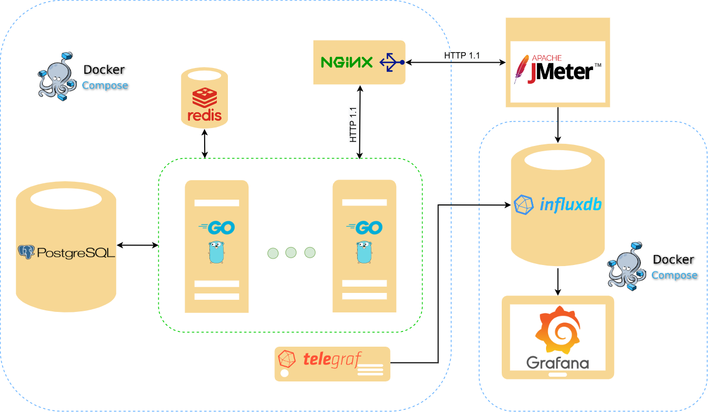

# Scalable web messenger application (thesis work)

## Intro

This thesis provides a performance and load evaluation and comparative analysis of scalable instant messaging web systems implemented in Go. Different system architectures with horizontal scalability (variable number of application servers) and vertical scalability (variable number of application server CPU cores) were considered. The literature analysis presents methods and problems related to web-based systems’ scalability and load balancing. The engineering aspect of the work includes designing and implementing selected architectural variants of a web system with scalability, implementing CRUD-type message processing operations by a messenger-type application, and the development and configuration of the environment used for performance and load testing of the system. The tests carried out consisted in comparing the performance of operations - the average response times of server applications to queries generated by the JMeter program for a given period, for each of the analyzed architectural variants of the system with scalability (taking into account the variable number of server CPU cores, the variable number of application server instances, as well as the Least Connections type load balancing mechanism). The tests evaluated the performance of the operation and stability of the systems under different loads. The obtained results were presented in tabular orm and on graphs and then interpreted and analyzed to determine their statistical significance. Based on the results obtained and the analysis of the state of research in the problem field, the conclusions on evaluating the performance and usability of the developed variants of the messenger-type web system with scalability were presented.

## Architecture

Project includes messenger backend application and testing infrastructure to measure performance



Used technologies
 - Go (golang): : gorilla/mux, dgrijalva/jwt-go, gorm, go-redis/redis, go.uber.org/fx
 - PostgrSQL
 - Redis
 - NGINX
 - Docker
 - Jmeter
 - Telegraf
 - Grafana
 - Influxdb

## installation and Running

### Build and run backend application

Run following command in `app` folder:
```
docker-compose --profile haproxy -f ./deploy/docker-compose.yml up --build
```
or
```
docker-compose --profile nginx -f ./deploy/docker-compose.yml build
docker-compose --profile nginx -f ./deploy/docker-compose.yml up
```

Default configuration files are located in `app/deploy/config`

To test another configuration of system modify `app/deploy/docker-compose.yml`

To setup NGINX use `app/configs/nginx.config`

To setup ip address of InfluxDB storage for telegraf data - use `app/configs/telegraf.config`

### Deploy and run tests
Run following command in `test`
```
docker-compose --profile nginx -f ./deploy/docker-compose.yml up --build
```
Run JMeter and import test scripts from `test/jmeter`.
